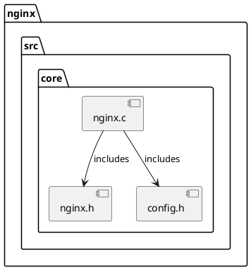

# Visualization Guide

Transform your sgraph models into beautiful, interactive visualizations for better understanding of your software architecture.

## Overview

sgraph supports multiple visualization formats and tools:

| Format | Best For | Interactive | Tool Support |
|--------|----------|-------------|--------------|
| **PlantUML** | Documentation, reports | No | Many editors |
| **Cytoscape.js** | Web applications | Yes | Browsers |
| **3D Force Graph** | Large networks | Yes | Browsers |
| **GraphML** | Research, analysis | No | Gephi, yEd |
| **DOT/Graphviz** | Simple diagrams | No | Graphviz tools |

## PlantUML Diagrams

PlantUML creates professional diagrams perfect for documentation.

### Basic Usage

```python
from sgraph.converters.xml_to_plantuml import XmlToPlantUml

# Convert model to PlantUML
converter = XmlToPlantUml()
converter.convert('model.xml', 'architecture.puml')
```

### Generated PlantUML Example



### Customizing PlantUML Output

```python
def create_styled_plantuml(model_path, output_path):
    # Generate basic PlantUML
    converter = XmlToPlantUml()
    converter.convert(model_path, 'temp.puml')
    
    # Read and enhance
    with open('temp.puml', 'r') as f:
        content = f.read()
    
    # Add custom styling
    styled_content = """@startuml
!theme vibrant
skinparam backgroundColor #FAFAFA
skinparam package {
    BackgroundColor #E8F4FD
    BorderColor #1565C0
    FontColor #0D47A1
}
skinparam component {
    BackgroundColor #F3E5F5
    BorderColor #7B1FA2
    FontColor #4A148C
}
skinparam arrow {
    Color #1976D2
    FontColor #1976D2
}

""" + content.replace("@startuml", "").replace("@enduml", "") + "\n@enduml"
    
    # Save styled version
    with open(output_path, 'w') as f:
        f.write(styled_content)
    
    # Clean up
    os.remove('temp.puml')

# Usage
create_styled_plantuml('model.xml', 'styled_architecture.puml')
```

### Generating Images

```bash
# Install PlantUML
npm install -g plantuml

# Generate PNG
plantuml architecture.puml

# Generate SVG (better for web)
plantuml -tsvg architecture.puml

# Generate PDF (for documentation)
plantuml -tpdf architecture.puml
```

## Interactive Web Visualizations

### Cytoscape.js Networks

Perfect for detailed, interactive analysis.

```python
from sgraph.converters.sgraph_to_cytoscape import SGraphToCytoscape

# Create interactive network
converter = SGraphToCytoscape()
converter.convert('model.xml', 'network.html')
```

#### Features
- **Zoom and Pan**: Navigate large networks
- **Node Selection**: Click to highlight dependencies
- **Search**: Find specific elements
- **Filtering**: Show/hide element types
- **Layouts**: Multiple automatic layouts

#### Custom Cytoscape Styling

```javascript
// Add to your Cytoscape HTML
var style = [
  {
    selector: 'node[type="function"]',
    style: {
      'background-color': '#3498db',
      'border-color': '#2980b9',
      'label': 'data(name)',
      'font-size': '12px'
    }
  },
  {
    selector: 'node[type="class"]',
    style: {
      'background-color': '#e74c3c',
      'border-color': '#c0392b',
      'shape': 'rectangle'
    }
  },
  {
    selector: 'edge[type="calls"]',
    style: {
      'line-color': '#95a5a6',
      'target-arrow-color': '#95a5a6',
      'curve-style': 'bezier'
    }
  }
];
```

### 3D Force Graph

Ideal for exploring large, complex networks.

```python
from sgraph.converters.xml_to_3dforcegraph import XmlTo3DForceGraph

# Create 3D visualization
converter = XmlTo3DForceGraph()
converter.convert('large_model.xml', 'force_graph.html')
```

#### Features
- **3D Navigation**: Rotate, zoom, pan
- **Physics Simulation**: Natural clustering
- **Performance**: Handles 10K+ nodes
- **Search**: Find and highlight nodes
- **Filtering**: Real-time filtering

#### Customizing 3D Force Graph

```javascript
// Configuration options
const Graph = ForceGraph3D()
  .nodeAutoColorBy('type')
  .nodeThreeObject(node => {
    // Custom 3D objects for different types
    if (node.type === 'class') {
      const geometry = new THREE.BoxGeometry(5, 5, 5);
      const material = new THREE.MeshBasicMaterial({ color: 'red' });
      return new THREE.Mesh(geometry, material);
    }
    // Default sphere for other types
    return new THREE.Mesh(
      new THREE.SphereGeometry(3),
      new THREE.MeshBasicMaterial({ color: node.color })
    );
  })
  .linkColor(() => 'rgba(255,255,255,0.2)')
  .linkWidth(2);
```

## Professional Graph Tools

### Gephi Integration

Gephi is a powerful graph analysis platform.

```python
from sgraph.converters.xml_to_graphml import XmlToGraphMl

# Convert to GraphML for Gephi
converter = XmlToGraphMl()
converter.convert('model.xml', 'network.graphml')
```

#### Gephi Workflow
1. **Import**: File → Open → Select `network.graphml`
2. **Layout**: Choose layout (Force Atlas 2, Fruchterman Reingold)
3. **Style**: Adjust node sizes, colors by attributes
4. **Filter**: Apply filters to focus on subsets
5. **Export**: File → Export → Choose format (PNG, PDF, SVG)

#### Gephi Tips
- Use **Force Atlas 2** for social network-like structures
- Use **Yifan Hu** for hierarchical structures
- Color nodes by **type** or **module**
- Size nodes by **degree** or **importance**

### yEd Graph Editor

Professional diagramming tool with excellent layouts.

```python
# GraphML works directly with yEd
converter = XmlToGraphMl()
converter.convert('model.xml', 'diagram.graphml')
```

#### yEd Features
- **Hierarchical Layouts**: Perfect for software architecture
- **Organic Layouts**: Great for dependency networks
- **Manual Editing**: Fine-tune automatic layouts
- **Export Options**: High-quality images and PDFs

## Command Line Visualization

### Quick Graphviz Diagrams

```python
from sgraph.converters.xml_to_dot import XmlToDot

# Generate DOT format
converter = XmlToDot()
converter.convert('model.xml', 'graph.dot')
```

```bash
# Generate images with Graphviz
dot -Tpng graph.dot -o architecture.png
dot -Tsvg graph.dot -o architecture.svg

# Different layouts
circo -Tpng graph.dot -o circular.png    # Circular layout
fdp -Tpng graph.dot -o force.png         # Force-directed
sfdp -Tpng graph.dot -o large.png        # For large graphs
```

## Specialized Visualizations

### Dependency Trees

```python
def create_dependency_tree(model_path, root_element_name):
    """Create a tree view of dependencies from a root element"""
    from sgraph.modelapi import ModelApi
    
    api = ModelApi(filepath=model_path)
    roots = api.getElementsByName(root_element_name)
    
    if not roots:
        print(f"Element '{root_element_name}' not found")
        return
    
    def print_tree(element, visited=None, indent=0):
        if visited is None:
            visited = set()
        
        if element.getPath() in visited:
            print("  " * indent + f"↻ {element.name} (circular)")
            return
        
        visited.add(element.getPath())
        print("  " * indent + f"📁 {element.name}")
        
        # Show dependencies
        for assoc in element.getAssociationsFrom():
            print("  " * (indent + 1) + f"🔗 {assoc.toElement.name} ({assoc.type})")
            if indent < 3:  # Limit depth
                print_tree(assoc.toElement, visited.copy(), indent + 2)
    
    print_tree(roots[0])

# Usage
create_dependency_tree('model.xml', 'main')
```

### Metrics Heatmaps

```python
def create_complexity_heatmap(model_path):
    """Create visualization showing complexity hotspots"""
    from sgraph.modelapi import ModelApi
    import json
    
    api = ModelApi(filepath=model_path)
    elements = api.getAllElements()
    
    # Calculate complexity for each element
    complexity_data = []
    for element in elements:
        fan_out = len(element.getAssociationsFrom())
        fan_in = len(element.getAssociationsTo())
        complexity = fan_out + fan_in
        
        complexity_data.append({
            'id': element.getPath(),
            'name': element.name,
            'complexity': complexity,
            'fan_out': fan_out,
            'fan_in': fan_in,
            'type': element.getAttribute('type', 'unknown')
        })
    
    # Sort by complexity
    complexity_data.sort(key=lambda x: x['complexity'], reverse=True)
    
    # Generate HTML heatmap
    html_content = f"""
<!DOCTYPE html>
<html>
<head>
    <title>Complexity Heatmap</title>
    <style>
        .heatmap {{ font-family: Arial, sans-serif; }}
        .element {{ 
            margin: 2px; 
            padding: 5px; 
            border-radius: 3px; 
            display: inline-block;
            min-width: 100px;
            text-align: center;
            color: white;
            font-size: 12px;
        }}
        .high {{ background-color: #e74c3c; }}
        .medium {{ background-color: #f39c12; }}
        .low {{ background-color: #27ae60; }}
    </style>
</head>
<body>
    <h1>Complexity Heatmap</h1>
    <div class="heatmap">
"""
    
    for data in complexity_data[:50]:  # Top 50
        css_class = 'high' if data['complexity'] > 10 else 'medium' if data['complexity'] > 5 else 'low'
        html_content += f"""
        <div class="element {css_class}" title="{data['id']} - Complexity: {data['complexity']}">
            {data['name']}<br>
            <small>{data['complexity']}</small>
        </div>
"""
    
    html_content += """
    </div>
</body>
</html>
"""
    
    with open('complexity_heatmap.html', 'w') as f:
        f.write(html_content)
    
    print("Complexity heatmap created: complexity_heatmap.html")

# Usage
create_complexity_heatmap('model.xml')
```

### Architecture Layer Diagrams

```python
def create_layer_diagram(model_path):
    """Create a layered architecture diagram"""
    from sgraph.modelapi import ModelApi
    
    api = ModelApi(filepath=model_path)
    elements = api.getAllElements()
    
    # Define layers
    layers = {
        'presentation': [],
        'business': [],
        'data': []
    }
    
    # Classify elements into layers
    for element in elements:
        path = element.getPath().lower()
        if any(keyword in path for keyword in ['view', 'controller', 'ui']):
            layers['presentation'].append(element)
        elif any(keyword in path for keyword in ['service', 'business', 'domain']):
            layers['business'].append(element)
        elif any(keyword in path for keyword in ['repository', 'dao', 'data']):
            layers['data'].append(element)
    
    # Generate PlantUML
    plantuml_content = """@startuml
!theme vibrant

package "Presentation Layer" {
"""
    
    for element in layers['presentation'][:10]:  # Limit for readability
        plantuml_content += f"  [{element.name}]\n"
    
    plantuml_content += """}

package "Business Layer" {
"""
    
    for element in layers['business'][:10]:
        plantuml_content += f"  [{element.name}]\n"
    
    plantuml_content += """}

package "Data Layer" {
"""
    
    for element in layers['data'][:10]:
        plantuml_content += f"  [{element.name}]\n"
    
    plantuml_content += """}

' Add some relationships
"""
    
    # Add cross-layer relationships
    for element in layers['presentation'][:5]:
        for assoc in element.getAssociationsFrom():
            if assoc.toElement in layers['business']:
                plantuml_content += f"[{element.name}] --> [{assoc.toElement.name}]\n"
    
    plantuml_content += "\n@enduml"
    
    with open('layers.puml', 'w') as f:
        f.write(plantuml_content)
    
    print("Layer diagram created: layers.puml")

# Usage
create_layer_diagram('model.xml')
```

## Performance Considerations

### Large Graph Visualization

```python
def optimize_for_visualization(model_path, max_nodes=1000):
    """Optimize large models for visualization"""
    from sgraph.modelapi import ModelApi
    from sgraph.algorithms.sgraphfiltering import SGraphFiltering
    
    api = ModelApi(filepath=model_path)
    
    # Get most connected elements
    elements = api.getAllElements()
    element_scores = []
    
    for element in elements:
        score = len(element.getAssociationsFrom()) + len(element.getAssociationsTo())
        element_scores.append((element, score))
    
    # Sort by connectivity
    element_scores.sort(key=lambda x: x[1], reverse=True)
    
    # Take top N most connected elements
    important_elements = [elem for elem, score in element_scores[:max_nodes]]
    important_paths = {elem.getPath() for elem in important_elements}
    
    # Create filtered model
    filtered_model = SGraph(SElement(None, ''))
    
    for element in important_elements:
        new_elem = filtered_model.createOrGetElementFromPath(element.getPath())
        # Copy attributes
        for key, value in element.getAllAttributes().items():
            new_elem.addAttribute(key, value)
    
    # Add relationships between important elements
    for element in important_elements:
        for assoc in element.getAssociationsFrom():
            if assoc.toElement.getPath() in important_paths:
                from_elem = filtered_model.createOrGetElementFromPath(element.getPath())
                to_elem = filtered_model.createOrGetElementFromPath(assoc.toElement.getPath())
                new_assoc = SElementAssociation(from_elem, to_elem, assoc.type)
                new_assoc.initElems()
    
    # Save optimized model
    filtered_model.to_xml('optimized_for_viz.xml')
    print(f"Optimized model saved with {len(important_elements)} elements")

# Usage
optimize_for_visualization('huge_model.xml', max_nodes=500)
```

## Integration Examples

### Jupyter Notebook Integration

```python
# In Jupyter notebook
from IPython.display import HTML, display
from sgraph.converters.sgraph_to_cytoscape import SGraphToCytoscape

def show_interactive_graph(model_path):
    """Display interactive graph in Jupyter"""
    converter = SGraphToCytoscape()
    
    # Generate minimal HTML for embedding
    html_content = converter.generate_embed_html(model_path)
    
    display(HTML(html_content))

# Usage in notebook
show_interactive_graph('model.xml')
```

### Web Application Integration

```javascript
// React component example
import React, { useEffect, useRef } from 'react';
import cytoscape from 'cytoscape';

function ArchitectureViewer({ modelData }) {
  const containerRef = useRef(null);
  
  useEffect(() => {
    const cy = cytoscape({
      container: containerRef.current,
      elements: modelData,
      style: [
        {
          selector: 'node',
          style: {
            'background-color': '#666',
            'label': 'data(name)',
            'font-size': '12px'
          }
        }
      ],
      layout: { name: 'cose' }
    });
    
    return () => cy.destroy();
  }, [modelData]);
  
  return <div ref={containerRef} style={{ width: '100%', height: '500px' }} />;
}
```

## Best Practices

### Choosing Visualization Types

**Use PlantUML for:**
- 📄 Documentation and reports
- 🎯 Focused, clean diagrams
- 📋 Architecture overviews

**Use Cytoscape.js for:**
- 🌐 Interactive web applications
- 🔍 Detailed analysis interfaces
- 🎮 User-driven exploration

**Use 3D Force Graph for:**
- 🚀 Large datasets (1000+ nodes)
- 🎪 Impressive demonstrations
- 🔮 Pattern discovery in complex networks

**Use Gephi/yEd for:**
- 📊 Research and analysis
- 🎨 Publication-quality images
- 🔧 Fine-tuned manual layouts

### Color Coding Strategies

```python
# Consistent color scheme
COLOR_SCHEME = {
    'function': '#3498db',      # Blue
    'class': '#e74c3c',         # Red
    'module': '#2ecc71',        # Green
    'package': '#9b59b6',       # Purple
    'interface': '#f39c12',     # Orange
    'test': '#95a5a6'          # Gray
}

def apply_color_coding(element):
    element_type = element.getAttribute('type', 'unknown')
    return COLOR_SCHEME.get(element_type, '#34495e')
```

### Performance Tips

1. **Limit Node Count**: Cap visualizations at 1000-2000 nodes
2. **Filter Strategically**: Show only relevant relationships
3. **Use Clustering**: Group related elements
4. **Progressive Loading**: Load details on demand
5. **Cache Results**: Save processed visualizations

Ready to create stunning visualizations of your software architecture! 🎨📊

